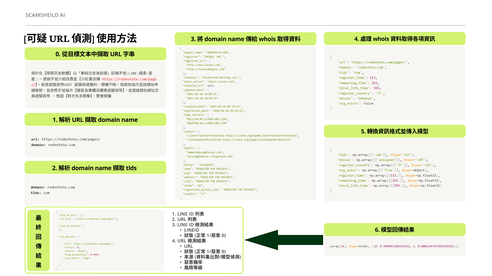
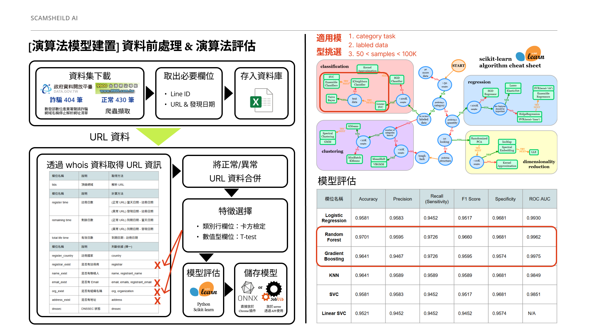

# Faudlens Detector

> **A scam detection tool for identifying fraudulent Line IDs and URLs. It is a modular engine that extracts Line IDs and URLs from input text, performs blacklist matching against open data sources, and—if no match is found for a URL—retrieves WHOIS information to be processed and fed into a pretrained data mining model for scam probability estimation.**
>
> *Supports both Python and RESTful API usage. Optional modules are available for dataset downloading, preprocessing, feature selection, model evaluation, and model training.*

---

## Authors

* [Jerry Hung](https://github.com/JerryHung1030)
* [Ken Su](https://github.com/ken22i)
* [SJ](https://github.com/shih1999)

---

## Table of Contents

1. [✨ Features](#-features)
2. [🧩 Usage Modes](#-usage-modes)
3. [🗺️ Architecture Overview](#-architecture-overview)
4. [📂 Project Structure](#-project-structure)
5. [🚀 How to Run](#-how-to-run)
6. [🛠️ API Usage](#-api-usage)
7. [🔭 What's Next](#-whats-next)
8. [📄 License](#-license)


---

## ✨ Features

* **Entity Extraction**: Extracts URLs and Line IDs from unstructured input text.
* **Blacklist Matching**: Cross-references extracted entities against open data blacklist sources.
* **WHOIS Enrichment**: Retrieves and processes domain registration metadata for unmatched URLs.
* **Scam Prediction**: Estimates scam probability using a pretrained data mining model.
* **Optional Utility Scripts**:
  * Dataset downloading and preprocessing
  * Feature selection and model evaluation
  * Training and exporting custom detection models

---

### 🧩 Usage Modes

**Basic Mode**  
Use the provided pretrained model and blacklist DB with the API interface for immediate scam detection. No setup or training required.

**Advanced Mode**  
Customize the detection pipeline by:
- Downloading and preparing your own datasets
- Performing feature selection and model evaluation
- Training your own models and exporting them in ONNX format

---

## 🗺️ Architecture Overview



<br/>

```mermaid
flowchart TD

    %% ===Connection===

    %% === Optional Workflow ===
    subgraph "Data & Model Preparation"
        Z1["<b>Download Open Data</b><br/>Line ID & URL Blacklist"]
        Z2["<b>Extract Required Fields</b><br/>Save to .xlsx DB Files"]
        Z3["<b>URL Feature Extraction</b><br/>WHOIS Data <br> Fetching & Processing"]
        Z4["<b>Save Data</b><br/>to a Combined File"]
        Z5["<b>Model Training</b><br/>export into ONNX"]

        Y1["<b>Feature Selection</b><br>Evaluate which <br> columns to use"]
        Y2["<b>Model Selection</b><br/>Choose a algorithm with better performance"]

        Z1 --> Z2 --> Z3 --> Z4 --> Z5
        Y1 --> Y2 --> Z5
        Z4 --> Y1
    end

    %% === Main Pipeline ===
    subgraph "Basic Usage"
      A["<b>User Input</b><br/>Raw Text"] --> B["Extract Line IDs & URLs"]
      B --> |Optional <br/> Data Preparation| C["<b>Blacklist DB Matching</b> <br/> with Open Data"]
      C --> D["<b>WHOIS Enrichment</b><br/>for Unmatched URLs"]
      D -->| Optional <br/> Model Preparation | E["<b>Scam Prediction</b><br/>with Pretrained Model"]
      E --> F["<b>Return Result</b><br/>in Structured Output"]

    end
```

| | Basic Usage (Left) | Data & Model Preparation (Right) |
|:-:|:-:|:-:|
| Mode | Basic Mode | Advanced Mode |
| Description | The default and most straightforward way to use Fraudlens Detector. | An optional advanced workflow for customizing the detection engine. |
| Detail | Uses a pretrained model and open-data blacklists via API. No setup or model training required. | Involves dataset preparation, feature selection, model training, and ONNX export. Suitable for advanced or research-driven use cases. |

### Scam Detection Flow Introduction
> Below is a high-level illustration of how input data flows through the scam detection pipeline.



---

### Model Training Introduction
> This diagram outlines the optional model training process for advanced usage.



---

## 📂 Project Structure

```text
├── api/
│   ├── main.py                 
│   └── test/
│       └── test_analyze_api.http     
├── db/
│   ├── lineid_database.xlsx
│   ├── url_good_database.xlsx
│   └── url_bad_database.xlsx
├── docs/
│   ├── API.xlsx
│   └── training_tutorial.md
├── src/
│   ├── managers/
│   │   └── blacklist_manager.py  
│   ├── model/
│   │   └── GradientBoostingClassifier_model.onnx 
│   └── test/
│       └── blacklist_manager_test.py              
├── training/
│   ├── managers/
│   │   └── blacklist_manager.py 
│   ├── raw_data/
│   │   ├── line_opendata.csv
│   │   └── url_opendata.json 
│   └── main.py   
├── README.md
├── requirements.txt
└── run_api.py   
```

---

## 🚀 How to Run
The steps below assume a completely clean environment. They outline how to install Docker, build, and run the containers.

### 1. Prerequisites

- **Python ≥ 3.12**
- **Docker** and **Docker Compose**

### 2. Install Docker & Compose

```bash
curl -fsSL https://get.docker.com -o get-docker.sh
sudo sh get-docker.sh
```
Check installation
```bash
docker --version        # or: sudo docker run hello-world
docker compose version  # new‑style Compose CLI
```

### 3. Clone Repo

```bash
$ git clone https://github.com/JerryHung1030/fraudlens-detector.git
$ cd fraudlens-detector
```

### 4. Run with Docker Compose
To start the containers in detached mode (running in the background):
```bash
sudo docker compose up -d
```
If you need to rebuild the images before starting (e.g., after changing the Dockerfile or dependencies):
```bash
sudo docker compose up -d --build
```

> The API will be available at `http://localhost:8001` by default.

To stop the service, press CTRL+C in the terminal or run:
```bash
docker-compose down
```

---

## 🛠️ API Usage

### Main Endpoints

| Name | Method | Route | Function |
|:-:|:-:|:-:|:-:|
| blacklist_api | POST | `/analyze` | Accepts a text input, returns a list of extracted Line IDs and URLs along with their respective detection results. |

### Full API Documentation
More detailed API document is available at [docs/api_spec.xlsx](docs/api_spec.xlsx)

---

## 🔭 What's Next
- Improve regular expression to match more kinds of case formats.

---

## 📄 License

Proprietary Software License Agreement

Copyright (c) 2025 Institute for Information Industry (III), Cyber Security Technology Institute (CSTI)

All rights reserved. This software is proprietary and confidential. Unauthorized copying, modification, distribution, or use is strictly prohibited.

> © 2025 Institute for Information Industry (III), Cyber Security Technology Institute (CSTI).