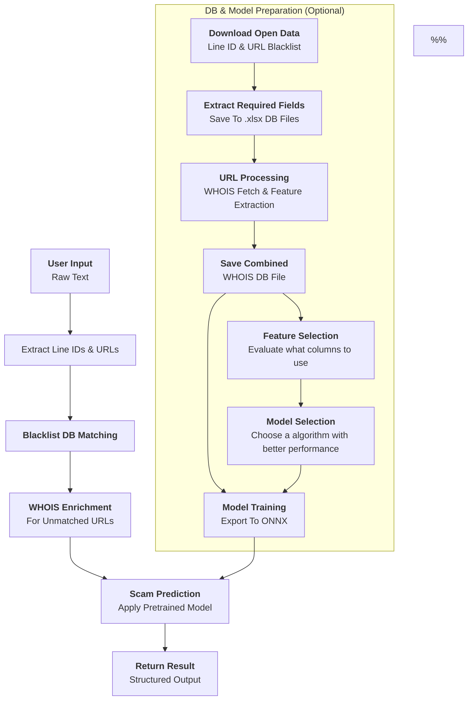

# Scamshield Ai

> **A scam detection tool for identifying fraudulent Line IDs and URLs. It is a modular engine that extracts Line IDs and URLs from input text, performs blacklist matching against open data sources, and—if no match is found for a URL—retrieves WHOIS information to be processed and fed into a pretrained data mining model for scam probability estimation.**
>
> *Supports both Python and RESTful API usage. Optional modules are available for dataset downloading, preprocessing, feature evaluation, model evaluation, and model training.*

---

## Authors

* [Jerry Hung](https://github.com/JerryHung1030)
* [Ken Su](https://github.com/ken22i)
* [SJ](https://github.com/shih1999)

---

## Table of Contents

1. [✨ Features](#-features)
2. [🧩 Usage Modes](#-usage-modes)
3. [🗺️ Architecture Overview](#-architecture-overview)
4. [📂 Project Structure](#-project-structure)
5. [🚀 Quick Start](#-quick-start)
6. [⚙️ Configuration](#-configuration) <!-- 如果有這一節，請加上 -->
7. [🛠️ CLI & API Usage](#-cli--api-usage)
8. [🧪 Testing](#-testing)
9. [🤝 Contributing](#-contributing)
10. [📄 License](#-license)


---

## ✨ Features

* **Entity Extraction**: Extracts URLs and Line IDs from unstructured input text.
* **Blacklist Matching**: Cross-references extracted entities against open data blacklist sources.
* **WHOIS Enrichment**: Retrieves and processes domain registration metadata for unmatched URLs.
* **Scam Prediction**: Estimates scam probability using a pretrained data mining model.
* **Optional Utility Scripts**:
  * Dataset downloading and preprocessing
  * Feature selection and model evaluation
  * Training and exporting custom detection models

---

### 🧩 Usage Modes

**Basic Mode**  
Use the provided pretrained model and blacklist DB with the API interface for immediate scam detection. No setup or training required.

**Advanced Mode**  
Customize the detection pipeline by:
- Downloading and preparing your own datasets
- Performing feature selection and model evaluation
- Training your own models and exporting them in ONNX format

## 🗺️ Architecture Overview


---
## 📂 Project Structure

```text
├── api/
│   ├── main.py                 
│   └── test/
│       └── test_analyze_api.http     
├── db/
│   ├── lineid_database.xlsx
│   ├── url_good_database.xlsx
│   └── url_bad_database.xlsx
├── docs/
│   ├── API.xlsx
│   └── training_tutorial.md
├── src/
│   ├── managers/
│   │   └── blacklist_manager.py  
│   ├── model/
│   │   └── GradientBoostingClassifier_model.onnx 
│   └── test/
│       └── blacklist_manager_test.py              
├── training/
│   ├── managers/
│   │   └── blacklist_manager.py 
│   ├── raw_data/
│   │   ├── line_opendata.csv
│   │   └── url_opendata.json 
│   └── main.py   
├── README.md
├── requirements.txt
└── run_api.py   
```

---

## 🚀 Quick Start

### 1. Prerequisites

* **Python ≥ 3.10**

### 2. Environment Setup

- None

### 3. Clone & Install

```bash
# Clone repo
$ git clone https://github.com/JerryHung1030/scamshield-ai.git
$ cd scamshield-ai

# Create and activate venv
$ python -m venv .venv && source .venv/bin/activate

# Install dependencies
$ pip install -r requirements.txt
```

### 4. Launch the **FastAPI** endpoint 
```bash
$ python run_api.py
```

---

## 🛠️ API Usage

#### Start the API Server

```bash
python run_api.py
```

The API will be available at `http://localhost:8001` by default.

#### Main Endpoints

| Name | Route | Function |
|:-:|:-:|:-:|
| blacklist_api | `/analyze` | Accepts a text input, returns a list of extracted Line IDs and URLs along with their respective detection results. |

## Scam Detection Flow Introduction
Below is a high-level illustration of how input data flows through the scam detection pipeline.


## Model Training Introduction
This diagram outlines the optional model training process for advanced usage.
